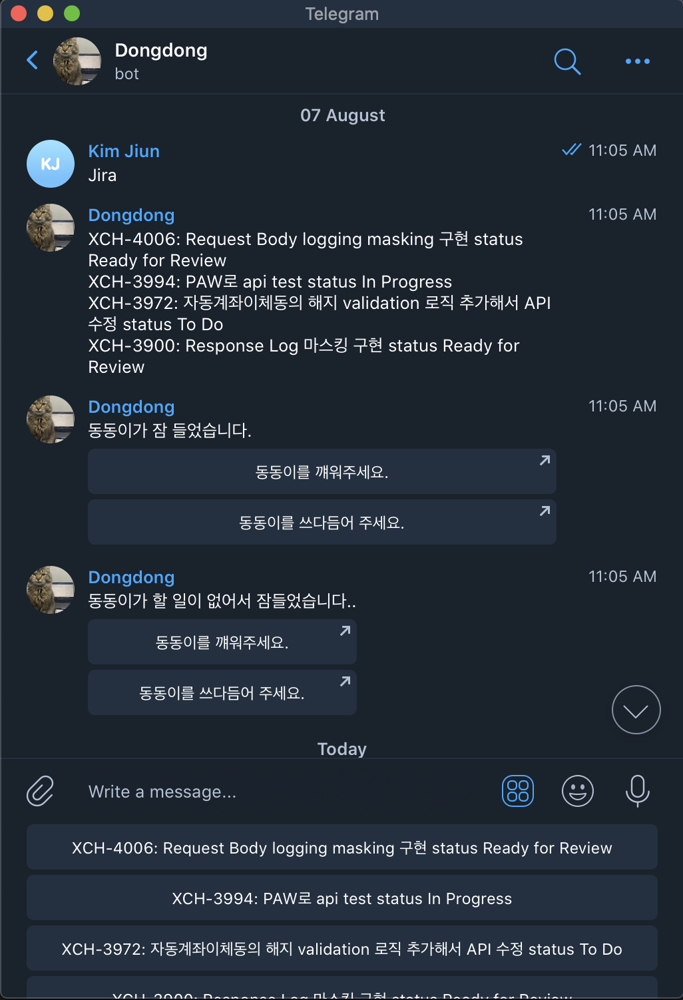

<!-- TABLE OF CONTENTS -->
## Table of Contents

* [About the Project](#about-the-project)
  * [Built With](#built-with)
* [Getting Started](#getting-started)
  * [Prerequisites](#prerequisites)
  * [Installation](#installation)
* [Usage](#usage)
* [Roadmap](#roadmap)
* [Contributing](#contributing)
* [Contact](#contact)

<!-- ABOUT THE PROJECT -->
## About The Project

[![Product Name Screen Shot][product-screenshot]](https://example.com)

My Secretary chatbot.
It can
- gather information from Jira ( Kasa's work management system ) and report to me ( Jira Open API)
- Tell me about my current geolocation (Google Map Open API)
- Report me about Github
- Report me about current balance of paper trading account in Alpaca trading system ( Alpaca Open API )

### Built With
* Python
* AWS Serverless
* Telegram Chatbot interface
* libraries = requests

<!-- GETTING STARTED -->
## Getting Started
[ Commands ]
- pipenv install
- pipenv shell
- python server.py

### Prerequisites
- Python 3.8
- pipenv

<!-- USAGE EXAMPLES -->
## Usage
Screenshots

<!-- ROADMAP -->
## Roadmap

See the [open issues]
(https://www.notion.so/Secretary-1da7035c583142c79f13197b2829df61) 
for where the project is going!

<!-- ACKNOWLEDGEMENTS -->
## Acknowledgements
1. Alpaca Trade API https://github.com/alpacahq/alpaca-trade-api-python
2. Telegram python wrapper https://github.com/eternnoir/pyTelegramBotAPI

<!-- CONTRIBUTING -->
## Contributing
**greatly appreciated**.
- https://github.com/eternnoir/pyTelegramBotAPI (python client telegram api library)
- https://github.com/alpacahq/alpaca-trade-api-python (python client alpaca api library)
- requests library

1. Fork the Project
2. Create your Branch 
3. Commit your Changes
4. Push to the Branch
5. Open a Pull Request

<!-- CONTACT -->
## Contact

Jiun Kim - 
Project Link: [https://github.com/jiun0507](https://github.com/jiun0507)
Email: jkim2@bowdoin.edu
